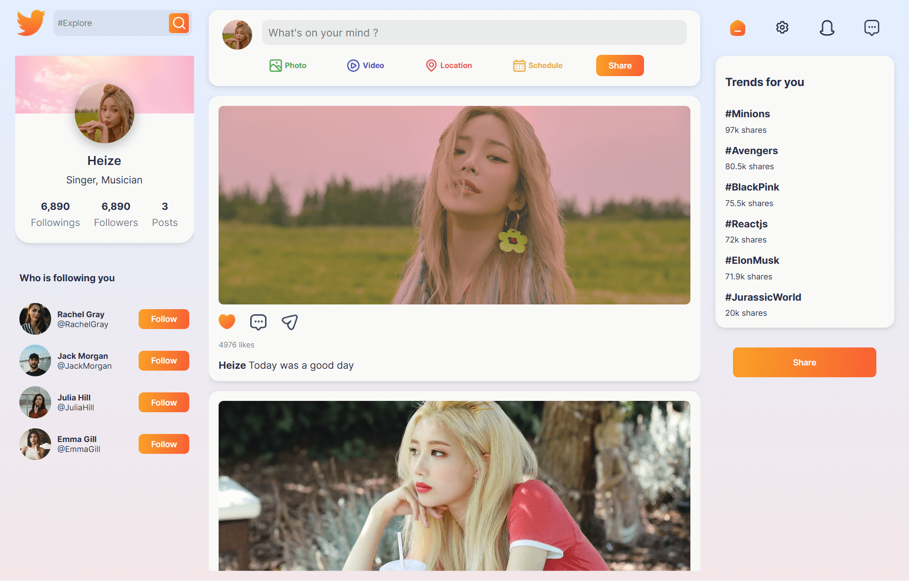

<div align="center">
    <a href="https://ksocial-fv.netlify.app" target="_blank">
      
    </a>
  <h3 align="center">KPOP Social App</h3>
</div>

##  <br /> 📋 <a name="table">Table of Contents</a>

- ✨ [Introduction](#introduction)
- ⚙️ [Tech Stack](#tech-stack)
- 📝 [Features](#features)
- 🚀 [Quick Start](#quick-start)

##  <br /> <a name="introduction">✨ Introduction</a>

**[EN]** A vibrant fullstack social media platform inspired by Kpop culture, built with React and featuring cozy, girly color palettes and aesthetics. The frontend leverages the Mantine library for UI components and Unicons for icons to deliver an engaging user experience. The backend is powered by Express, utilizing MongoDB for database management and includes essential packages such as bcrypt for password hashing, cors for cross-origin resource sharing, dotenv for environment variables, jsonwebtoken for authentication, multer for file uploads, and nodemon for development.

**[FR]** Un réseau social fullstack inspiré par la culture Kpop, construit avec React. Le frontend utilise la bibliothèque Mantine pour les composants UI et Unicons pour les icônes afin d'offrir une expérience utilisateur engageante. Le backend est alimenté par Express, utilisant MongoDB pour la gestion de base de données et comprend des packages essentiels tels que bcrypt pour le hachage des mots de passe, cors pour le partage de ressources entre origines, dotenv pour les variables d'environnement, jsonwebtoken pour l'authentification, multer pour le téléchargement de fichiers et nodemon pour le développement.

##  <br /> <a name="tech-stack">⚙️ Tech Stack</a>

- [**React**](https://react.dev/reference/react) is a popular JavaScript library for building user interfaces, particularly single-page applications where data changes over time. React's component-based architecture allows developers to create reusable UI components, making development more efficient and the codebase easier to maintain. 

- [**Mantine**](https://mantine.dev/getting-started/) is a modern React component library designed to streamline the creation of scalable and accessible UIs. It offers a rich set of customizable components and hooks, empowering developers to build robust applications with efficiency and accessibility in mind.

- [**React Unicons**](https://help.iconscout.com/hc/en-gb/articles/13811255780889-How-to-use-Unicons) is a versatile icon library for React applications, providing a wide range of high-quality icons that can be easily integrated into projects. It simplifies the process of adding icons to user interfaces, enhancing visual appeal and usability without compromising performance.

- [**Axios**](https://axios-http.com/docs/intro) is a promise-based HTTP client for the browser and Node.js. It allows you to make asynchronous HTTP requests to REST endpoints and perform CRUD operations. Axios provides a simple-to-use API for sending HTTP requests and handling responses, including features like interceptors for request and response transformations, automatic JSON data transformations, and support for handling request cancellation.

- [**Redux**](https://react-redux.js.org/introduction/getting-started) is a predictable state container for JavaScript apps, commonly used with libraries like React for managing application state. Redux centralizes the application's state in a single store, allowing you to write consistent, maintainable code with the ability to track state changes and debug easily. It relies on a unidirectional data flow, where actions are dispatched to reducers, which then update the state in an immutable way.

- [**Bcrypt**](https://www.npmjs.com/package/bcrypt) is a library used to hash passwords, providing security by making it computationally difficult to reverse the hashing process. It includes features such as salting, which adds additional randomness to the hashes, making them more secure against dictionary attacks and brute-force attacks.

- [**CORS**](https://www.npmjs.com/package/cors) (Cross-Origin Resource Sharing) is a node.js package for providing a Connect/Express middleware that can be used to enable CORS with various options. CORS is a security feature that allows or restricts requested resources on a web server depending on where the HTTP request was initiated.

- [**Dotenv**](https://www.npmjs.com/package/dotenv) is a zero-dependency module that loads environment variables from a .env file into process.env. This package helps keep sensitive configuration data out of the codebase and allows different configurations for various environments like development, testing, and production.

- [**Express**](https://expressjs.com/en/starter/installing.html) is a minimal and flexible Node.js web application framework that provides a robust set of features for web and mobile applications. It facilitates the rapid development of Node-based web applications, with features like routing, middleware support, and template engines.

- [**Jsonwebtoken**](https://www.npmjs.com/package/jsonwebtoken) is a package that allows you to generate and verify JSON Web Tokens (JWT). JWTs are used for securely transmitting information between parties as a JSON object. They are commonly used for authentication and authorization processes.

- [**Mongoose**](https://mongoosejs.com/docs/guide.html) is an ODM (Object Data Modeling) library for MongoDB and Node.js. It provides a straightforward, schema-based solution to model your application data, with built-in type casting, validation, query building, and business logic hooks.

- [**Multer**](https://www.npmjs.com/package/multer) is a middleware for handling multipart/form-data, which is primarily used for uploading files. It is written on top of the busboy library to make it easy to handle file uploads in an Express application.

- [**Nodemon**](https://www.npmjs.com/package/nodemon) is a utility that automatically restarts your node application when file changes in the directory are detected. It is designed to increase productivity by reducing the manual task of stopping and restarting the application during development.


## <br /> <a name="quick-start">🚀 Quick Start</a>

Follow these steps to set up the project locally on your machine.

<br/>**Prerequisites**

Make sure you have the following installed on your machine:

- [Git](https://git-scm.com/)
- [Node.js](https://nodejs.org/en)
- [npm](https://www.npmjs.com/) (Node Package Manager)

Install nodemon globally on your machine, open your terminal and run the following command:
```bash
npm install -g nodemon
```

- **Nodemon** is a tool that helps develop Node.js based applications by automatically restarting the node application when file changes in the directory are detected.

<br/>**Cloning the Repository**

```bash
git clone {git remote URL}
```

<br/>**Installation**

Let's install the project dependencies, from your terminal, run:

```bash
# Navigate to the client directory
cd client

# Install the necessary dependencies for the client-side application
npm install
# or
yarn install

# Navigate back to the root directory
cd ..

# Navigate to the server directory
cd api

# Install the necessary dependencies for the server-side application
npm install
# or
yarn install
```

<br/>**Set Up Environment Variables**

Create a new file named `.env` inside the client folder and add the following content:

```env
# Must write "REACT_APP" or it won't work
REACT_APP_PUBLIC_FOLDER=http://localhost:5000/images/
```

Create a new file named `.env` inside the api folder and add the following content:

```env
MONGO_URI=

PORT=5000

JWT_KEY=
```

Replace the placeholder values with your actual respective account credentials:

- [MongoDB](https://cloud.mongodb.com)


<br/>**Running the Project**

Installation will take a minute or two, but once that's done, you should be able to run the following command:

```bash
# Navigate to the client directory
cd client

# Start client
# If `npm start` doesn't work, try updating the dependencies in `package.json`.
npm start
# or
yarn start

# Navigate back to the root directory
cd ..

# Navigate to the server directory
cd api

# Start server
npm start
# or
yarn start
```

Open [`http://localhost:3000`](http://localhost:3000) in your browser to view the project.